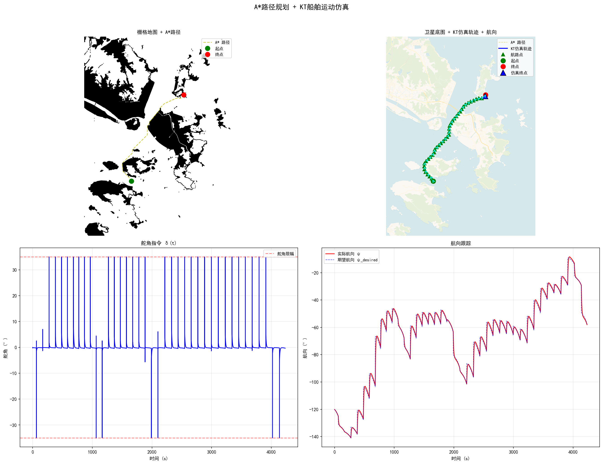
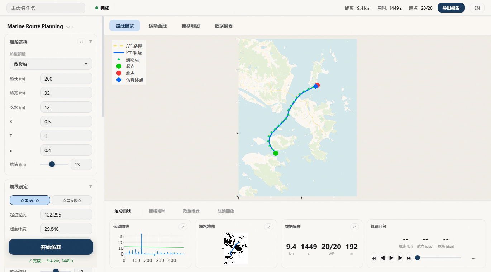
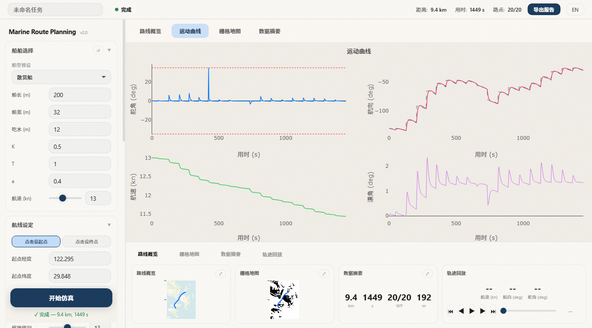
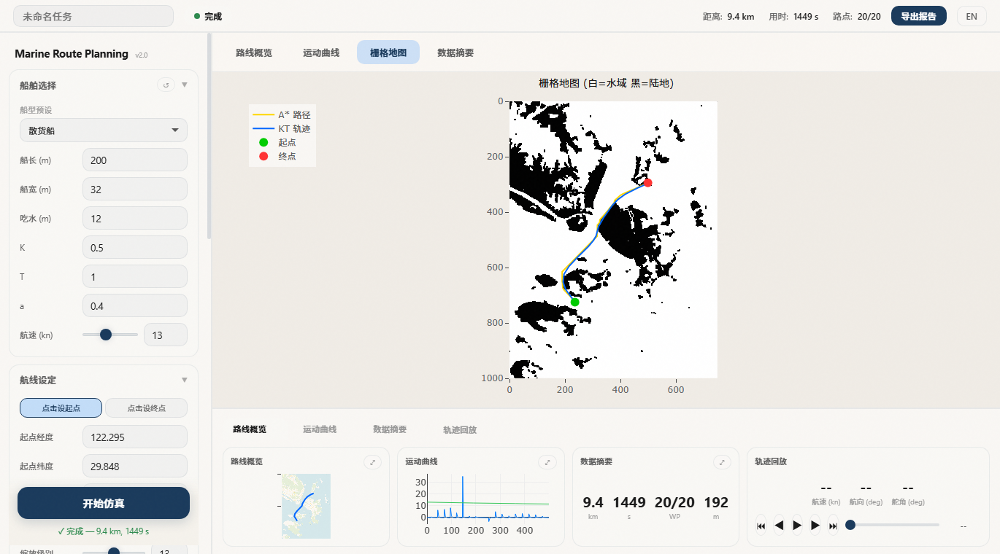
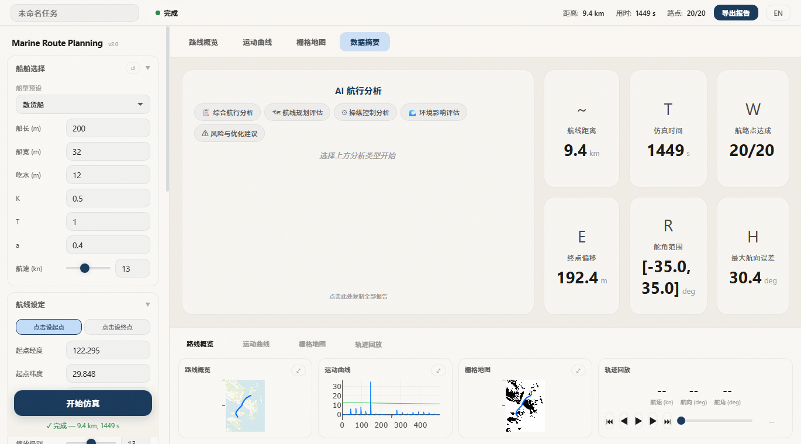
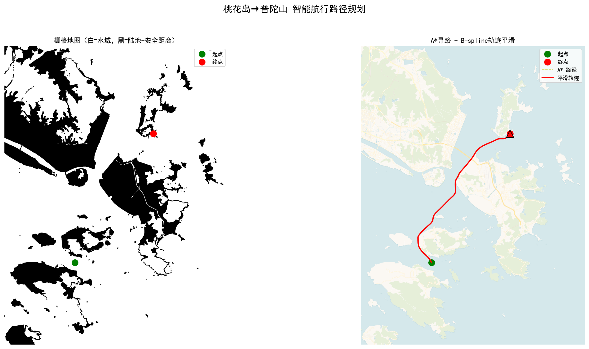
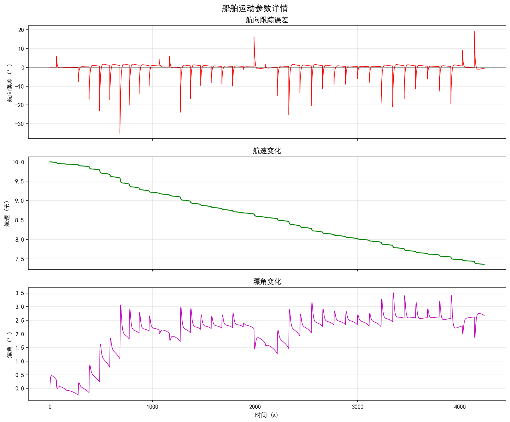

<div align="center">

# Marine Route Planning

**A* Path Planning + KT Ship Motion Model for Intelligent Navigation**

[](LICENSE)
[](https://www.python.org/)
[](https://opencv.org/)
[](https://scipy.org/)

A complete pipeline for autonomous ship route planning: from satellite chart acquisition and obstacle segmentation to shortest-path search, trajectory smoothing, and ship dynamics simulation with environmental disturbances.



</div>

---

## Table of Contents

<details>
<summary>Expand</summary>

- [Web GUI Dashboard](#web-gui-dashboard)
- [Overview](#overview)
- [System Architecture](#system-architecture)
- [Algorithm Details](#algorithm-details)
  - [1. Map Acquisition and Rasterization](#1-map-acquisition-and-rasterization)
  - [2. A* Pathfinding](#2-a-pathfinding)
  - [3. B-spline Trajectory Smoothing](#3-b-spline-trajectory-smoothing)
  - [4. KT Ship Motion Model](#4-kt-ship-motion-model)
  - [5. PID Heading Control](#5-pid-heading-control)
  - [6. Wind and Current Disturbance](#6-wind-and-current-disturbance)
- [Results](#results)
- [Quick Start](#quick-start)
- [Project Structure](#project-structure)
- [Ship Parameters](#ship-parameters)
- [Roadmap](#roadmap)
- [License](#license)

</details>

---

## Overview

This project addresses the problem of **autonomous ship route planning** in complex coastal waters. Starting from a pair of geographic coordinates (origin and destination), the system:

1. Downloads satellite chart tiles and rasterizes them into a navigability grid
2. Searches for the shortest obstacle-free path using the A* algorithm
3. Smooths the discrete path into a continuous, ship-navigable trajectory
4. Simulates the actual ship motion along the trajectory using the **KT (Nomoto) maneuvering model**, complete with PID heading control and environmental disturbances (wind + current)

The system is validated on a real-world route: **Taohua Island to Putuo Mountain** (Zhoushan Archipelago, China), a ~15 km route through island-dense waters.

> **New in v2.0:** Interactive Web GUI with satellite basemap, Nautical Light UI theme, DeepSeek AI navigation analysis, and one-click .exe packaging. See the `v2.0-navigator` branch or download `MarineRoutePlanning.exe`.

---

## Web GUI Dashboard

The interactive Flask + Plotly web interface provides a complete visual cockpit for route planning and simulation analysis.

### Route Overview


*Satellite basemap with A* global path (gold dash), KT trajectory (blue), waypoints (green triangles), and click-to-pick coordinate selection.*

### Motion Curves


*Four-quadrant real-time curves: rudder angle with saturation limits (red dash), heading tracking vs desired, speed profile, and drift angle.*

### Grid Map


*Binary occupancy grid (white = navigable water, black = land + safety margin) overlaid with planned path and simulated trajectory.*

### Data Summary & AI Analysis


*Key simulation metrics (distance, time, waypoints, offset, rudder range, heading error) plus DeepSeek-powered AI navigation analysis with 5 preset analysis types.*

**Web GUI Features:**
- Ship presets (bulk/tanker/container/passenger/tug) with automatic K/T/a/speed defaults
- Environment presets (calm/light/moderate/heavy) with wind/current/wave parameters
- PID controller presets (conservative/balanced/aggressive)
- Trajectory replay with playback controls and real-time metrics
- i18n support (Chinese / English) with one-click toggle
- JSON report export

---

## System Architecture

```
+---------------------------------------------------------------+
|                    Input: Start & Goal Coordinates             |
+----------------------------+----------------------------------+
                             |
                             v
+---------------------------------------------------------------+
|  Stage 1: Map Processing                                      |
|  +----------+  +----------+  +----------+  +--------------+   |
|  | CartoDB  |->|   OTSU   |->|Connected |->|   Safety     |   |
|  | Tile DL  |  |Threshold |  |Component |  |  Dilation    |   |
|  +----------+  +----------+  +----------+  +--------------+   |
+----------------------------+----------------------------------+
                             |
                             v
+---------------------------------------------------------------+
|  Stage 2: Path Planning                                       |
|  +----------+  +----------+  +--------------+                 |
|  |  A*      |->| B-spline |->|  Waypoint    |                 |
|  | Search   |  | Smoothing|  |  Extraction  |                 |
|  +----------+  +----------+  +--------------+                 |
+----------------------------+----------------------------------+
                             |
                             v
+---------------------------------------------------------------+
|  Stage 3: Ship Motion Simulation                              |
|  +----------+  +----------+  +----------+  +--------------+   |
|  |   PID    |->|   KT     |->|  Wind &  |->|  Trajectory  |   |
|  | Heading  |  |  Model   |  | Current  |  |   Output     |   |
|  +----------+  +----------+  +----------+  +--------------+   |
+---------------------------------------------------------------+
```

---

## Algorithm Details

### 1. Map Acquisition and Rasterization

Satellite chart tiles are fetched from the [CartoDB Voyager](https://carto.com/basemaps/) tile service at zoom level 13 (~19 m/pixel). The rasterization pipeline:

1. **Grayscale conversion** — color image to single channel
2. **OTSU thresholding** — automatic binary segmentation separating water (dark) from land (light). The optimal threshold T* is found by maximizing the inter-class variance:

$$T^* = \arg\max_T \sigma^2(T)$$

3. **Morphological opening** — removes bridge artifacts and thin land connections
4. **Connected component analysis** — retains only the largest water body as the main ocean
5. **Safety dilation** — expands land obstacles by 3 pixels (~57 m) to create a navigational safety margin

### 2. A* Pathfinding

The A* algorithm searches for the shortest path on the binary grid using the evaluation function:

$$f(n) = g(n) + h(n)$$

where:
- g(n) — actual cost from start to node n (diagonal moves cost sqrt(2), cardinal moves cost 1)
- h(n) — Euclidean distance from n to goal (admissible heuristic)

The search uses 8-directional movement with a binary heap priority queue, yielding O(|V| log |V|) time complexity.

### 3. B-spline Trajectory Smoothing

The discrete pixel path is smoothed using a B-spline curve:

$$C(u) = \sum_{i=0}^{n} P_i \cdot N_{i,k}(u)$$

where P_i are control points and N_{i,k}(u) are k-order B-spline basis functions. The smoothed curve is then uniformly sampled at 500 m intervals to produce a sequence of waypoints for ship tracking.

### 4. KT Ship Motion Model

The ship dynamics are modeled using the **nonlinear Nomoto (KT) equation**, a first-order approximation widely used in ship maneuvering:

$$\frac{dr}{dt} = \frac{K \cdot \delta - (1 + a |r|) r}{T}$$

$$\frac{du}{dt} = -0.02 \, u |r| - 0.005 \, u \, \delta^2$$

$$\frac{dv}{dt} = 0.15 \, r \, u - 0.25 \, v$$

where:
- r — yaw rate (rad/s)
- u — surge velocity (m/s)
- v — sway velocity (m/s)
- delta — rudder angle (rad)
- K — maneuverability index (turning ability)
- T — responsiveness index (yaw inertia)
- a — nonlinear damping coefficient

The position and heading are integrated as:

$$\frac{d\psi}{dt} = r, \quad \frac{dx}{dt} = u\cos\psi - v\sin\psi, \quad \frac{dy}{dt} = u\sin\psi + v\cos\psi$$

### 5. PID Heading Control

A PID controller tracks each waypoint by computing the rudder command from the heading error:

$$\delta_{cmd} = K_P \cdot e(t) + K_I \int e(t) \, dt + K_D \frac{de}{dt}$$

where e(t) = psi_desired - psi_actual is the heading error. The controller parameters are K_P = 1.0, K_I = 0.01, K_D = 5.0, with rudder angle limited to +/-35 deg.

### 6. Wind and Current Disturbance

Environmental disturbances are modeled as constant wind and current forces:

- **Wind**: V_w = 5 m/s from northeast (45 deg), lateral force on ship superstructure
- **Current**: V_c = 0.5 m/s from north (0 deg), additive velocity offset

The effective velocity becomes:

$$u_{eff} = u + V_c \cos(\psi_c - \psi), \quad v_{eff} = v + V_c \sin(\psi_c - \psi)$$

---

## Results

### A* Path Planning

<table>
<tr>
<td></td>
</tr>
</table>

<p align="center"><em>Left: Rasterized grid map (white = water, black = land + safety margin). Right: A* path (yellow dashed) and smoothed trajectory (red) on satellite chart.</em></p>

### KT Ship Motion Simulation

<table>
<tr>
<td></td>
</tr>
</table>

<p align="center"><em>Top-left: Grid map with A* path. Top-right: Satellite chart with KT trajectory (blue), waypoints (green), and heading arrows (cyan). Bottom-left: Rudder angle command. Bottom-right: Heading tracking (actual vs desired).</em></p>

### Motion Parameters Detail

<table>
<tr>
<td></td>
</tr>
</table>

<p align="center"><em>Top: Heading tracking error (within +/-5 deg). Middle: Speed drops during turns (from 10 kn to ~8.5 kn). Bottom: Drift angle under wind/current disturbance (+/-6 deg).</em></p>

### Key Metrics

| Metric | Value |
|--------|-------|
| Route distance (A* path) | ~21 km |
| Simulation time | 4235 s (~70 min) |
| Waypoints reached | 41 / 41 (100%) |
| Endpoint offset (with disturbance) | 187.8 m |
| Rudder angle range | [-35 deg, +35 deg] |
| Max heading error | ~10 deg |
| Speed during turns | ~8.5 kn |

---

## Quick Start

### Web GUI (recommended)

```bash
# Checkout the v2.0 Web GUI branch
git clone https://github.com/beahanbarry291994-cmd/Marine-Route-Planning.git
cd Marine-Route-Planning
git checkout v2.0-navigator
cd flask_gui

# Install dependencies
pip install -r requirements.txt

# Launch
python app.py
# Open http://localhost:5000
```

Or download `MarineRoutePlanning.exe` from the releases — double-click to launch, browser opens automatically.

### CLI / Script (master branch)

```bash
git clone https://github.com/beahanbarry291994-cmd/Marine-Route-Planning.git
cd Marine-Route-Planning
pip install numpy opencv-python matplotlib scipy
python main.py
```

Output files are generated in the current directory:
- `result*.png` — A* path on grid map and satellite chart
- `result_ship*.png` — 4-panel KT simulation result
- `result_motion_detail*.png` — heading error, speed, drift angle
- `animation*.gif` — animated ship movement

---

## Project Structure

```
Marine-Route-Planning/
|-- main.py                  # Full pipeline: A* + KT model + visualization
|-- requirements.txt         # Python dependencies
|-- LICENSE                  # MIT License
|
|-- src/                     # Modular source code
|   |-- map_processor.py     # Map fetching, rasterization, coordinate tools
|   |-- astar.py             # A* algorithm, path smoothing
|   +-- path_planner.py      # Pipeline orchestration, visualization
|
|-- data/                    # Cached map tiles
|-- output/                  # Result images and animations
|-- docs/                    # Technical documentation
+-- archive/                 # Historical iterations (v0-v5)
```

---

## Ship Parameters

The simulation uses **Mariner-class** vessel parameters:

| Parameter | Symbol | Value | Unit |
|-----------|--------|-------|------|
| Ship length | L | 160 | m |
| Beam | B | 21 | m |
| Draft | d | 8 | m |
| Block coefficient | Cb | 0.56 | — |
| Maneuverability index | K | 0.5 | — |
| Responsiveness index | T | 1.0 | — |
| Nonlinear coefficient | a | 0.4 | — |
| Initial speed | V0 | 10 | kn |
| Max rudder angle | delta_max | 35 | deg |
| Rudder rate | delta_dot | 2.5 | deg/s |

---

## Roadmap

- [x] A* shortest path search with 8-directional movement
- [x] OTSU adaptive thresholding for chart segmentation
- [x] B-spline trajectory smoothing with waypoint extraction
- [x] KT (Nomoto) ship motion model simulation
- [x] PID heading control for waypoint following
- [x] Wind and current disturbance modeling
- [x] Interactive Web GUI with satellite basemap and Plotly.js
- [x] DeepSeek AI navigation analysis (5 analysis types)
- [x] One-click .exe packaging (PyInstaller)
- [ ] MMG model integration for higher-fidelity dynamics
- [ ] COLREGS-compliant collision avoidance
- [ ] Multi-objective optimization (distance, safety, fuel)
- [ ] Real-time replanning with dynamic obstacle avoidance
- [ ] Dubins/Reeds-Shepp path integration for turning radius constraints

---

## License

This project is licensed under the MIT License — see [LICENSE](LICENSE) for details.
